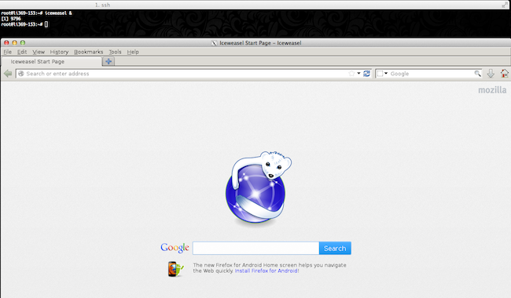

---
author:
  name: Alex Fornuto
  email: afornuto@linode.com
description: Forward the X11 Server Through SSH to Run GUI Applications from Your Linode
keywords: ["x11", "debian", "debain 7", " debian 8", "x-forwarding", "ssh", "x over ssh"]
tags: ["debian", "ssh"]
license: '[CC BY-ND 4.0](https://creativecommons.org/licenses/by-nd/4.0)'
aliases: ['/remote-desktops/running-graphic-software-on-your-linode-with-xforwarding-on-debian-7/','/applications/remote-desktop/running-graphic-software-xforwarding-debian/','/remote-desktops/x-forwarding-debian-7/']
modified: 2014-04-25
modified_by:
  name: Alex Fornuto
published: 2014-04-10
title: 'Run Graphic Software on Your Linode with X-Forwarding on Debian'
external_resources:
 - '[Xming](http://www.straightrunning.com/XmingNotes/)'
 - '[Cygwin/X](http://x.cygwin.com/)'
 - '[MobaXterm](http://mobaxterm.mobatek.net/)'
 - '[XQuartz](http://xquartz.macosforge.org/)'
relations:
    platform:
        key: forward-x11-gui
        keywords:
            - distribution: Debian
---

On occasion you may want to run an application that requires a graphic interface from your Linode. By using X forwarding, this is easy to accomplish.


This guide is written for a non-root user. Commands that require elevated privileges are prefixed with `sudo`. If you're not familiar with the `sudo` command, you can check our [Users and Groups](/docs/tools-reference/linux-users-and-groups/) guide.


## Install X11 on your Linode

1.  Before we begin, make sure your Linode's software is up to date:

        sudo apt-get update
        sudo apt-get upgrade

2.  One of the great things about using a Linux distribution with a dependency-aware package manager is that you can just install the application you want to run, and it will make sure you have all the required software. If you're installing a graphic utility, that will include X. For now, let's install `xauth`, which is required for X to authenticate through the SSH session:

        sudo apt-get install xauth

## Install X11 on the Client

### Linux

If you're using a Linux desktop environment on your local PC, you already have X11 running.

### Mac

Apple contributes to the development of XQuartz, an X11 server designed to run on OS X. Download the software [here](http://xquartz.macosforge.org/) and follow the installer's instructions.

### Windows

There are several pieces of software available that can provide an X server on Windows. We've listed the most notable options below:

-   [Cygwin/X](http://x.cygwin.com/) - Cygwin provides a Unix-like shell to Windows and can support an X server as well.
-   [MobaXterm](http://mobaxterm.mobatek.net/) - MobaXterm is an all-in-one tool for accessing remote systems across multiple protocols.
-   [Xming](http://www.straightrunning.com/XmingNotes/) - Unlike the previous two, Xming is just the X server itself. It is designed to be a lean standalone system and touts portability.

It's up to you to choose the software that best suits your needs.

## Connect

Connecting from a Linux or OS X client requires adding one extra parameter to your SSH command, the `-X` flag:

    ssh -X root@12.34.56.78

Connecting from a Windows machine will depend on what software you have chosen. Please refer to the software documentation for instructions on initiating an SSH connection with X forwarding.

## Test

1.  First lets install a simple graphic application to test with:

        sudo apt-get install x11-apps

2.  Run the following command to launch a program that watches your cursor:

        xeyes

3.  Now, let's try something a bit bigger. Iceweasel is the name given to Debian's version of Mozilla's Firefox browser. The following commands will install and launch Iceweasel from your Linode:

        sudo apt-get install iceweasel
        iceweasel &

    

 
More intense graphic software may lag when running in this fashion. Using a Linode in a data center geographically close to you can help reduce latency.

