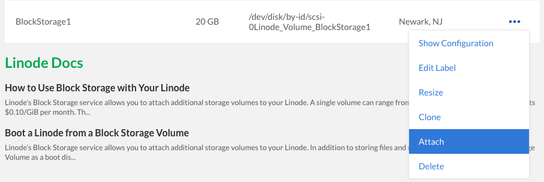

---
author:
  name: Linode
  email: docs@linode.com
description: 'Shortguide that describes how to safely detach your Volume from a Linode and attach it to a different Linode.'
license: '[CC BY-ND 4.0](https://creativecommons.org/licenses/by-nd/4.0)'
modified: 2020-07-20
modified_by:
  name: Heather Zoppetti
published: 2020-07-20
title: Transfer Your Block Storage to Another Linode
keywords: ["block storage"]
headless: true
show_on_rss_feed: false
tags: ["linode platform"]
aliases: ['/platform/block-storage/transfer-block-storage-volume-shortguide/']
---

Follow these steps to safely detach a Volume from a Linode and attach it to a different Linode in the same data center:


Volumes cannot be attached to Linodes that are in a different data center. See the [Transfer Block Storage Data between Data Centers](/docs/products/storage/block-storage/guides/transfer-volume-data-between-data-centers/) how-to for help with migrating data on a Volume to a different data center.


1. [Safely detach the Volume](/docs/products/storage/block-storage/guides/detach-volume/).

1.   Click the **more options ellipsis** to open the menu for the Volume you want to attach to a Linode and select **Attach**:

    

1.   Since the Volume already has a filesystem on it, create a mountpoint for the new Linode, provided it hasn't already been created:

        mkdir /mnt/BlockStorage1

1.   Mount the new Volume, where FILE_SYSTEM_PATH is your Volume’s file system path:

        mount FILE_SYSTEM_PATH /mnt/BlockStorage1

1.  If you want to mount the new Volume automatically every time your Linode boots, you'll want to add the following line to your **/etc/fstab** file:

        FILE_SYSTEM_PATH /mnt/BlockStorage1 ext4 defaults 0 2
