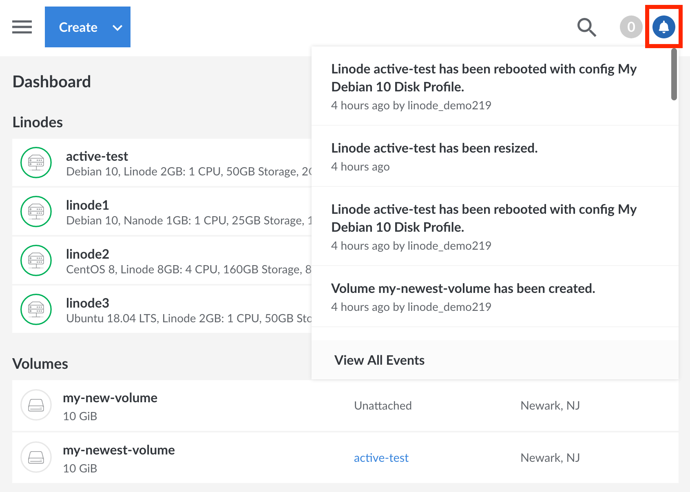

---
author:
  name: Linode
  email: docs@linode.com
description: 'Understanding the event and activity feeds in the Linode Cloud Manager'
og_description: 'Understanding the event and activity feeds in the Linode Cloud Manager'
keywords: ["accounts", "passwords", "linode manager", "manager"]
license: '[CC BY-ND 4.0](https://creativecommons.org/licenses/by-nd/4.0)'
image: UnderstandingtheCloudManagerEventsandActivityFeeds.png
title: "What Are the Cloud Manager Events and Activity Feeds"
h1_title: "Understanding the Cloud Manager Events and Activity Feeds"
published: 2019-12-26
modified_by:
  name: Linode
tags: ["linode platform","cloud manager"]
aliases: ['/platform/manager/what-are-the-cloud-manager-events-and-activity-feeds/']
---

Tasks performed using the Linode Cloud Manager or other account specific tools like Linode's [CLI](https://www.linode.com/docs/platform/api/linode-cli/) or [API](https://www.linode.com/products/api/) will be logged to an individual Linode's activity feed, or on your account's [Events Page](https://cloud.linode.com/events). The events and activity pages are user accessible logs, or histories of events taking place on your account. They contain details regarding the most notable events affecting your Linodes, like reboots, shutdowns, migrations, and more.

### In This Guide
 - You'll learn [how to navigate to the events page](#event-s-page).
 - And [how to find an individual Linode's activity feed](#linode-activity-feed).


The Events Page will be limited to information tied into User Permissions as set for each individual user on an account. For more information, see our [Accounts and Passwords](https://www.linode.com/docs/platform/manager/accounts-and-passwords/#users-and-permissions) guide.


## Events Page

Your account's [Events Page](https://cloud.linode.com/events) is a history, or a log, of all activity pertaining to your Linode Account. This includes changes to all billable resources, domains using our DNS Manager, StackScripts, and other events that take place affecting your account, like opening a new support ticket.

1. The [Events Page](https://cloud.linode.com/events) can be found by logging into the Cloud Manager and selecting the bell icon at the top right of the page. This will list the most recent events on your account. Each event will contain a brief descriptor of the event, a rounded amount of time to give you an idea of how long ago it occurred, and in some cases will show the user who initiated the event.

    

1. To view more events and additional details pertaining to them, select  **View All Events** at the bottom of the list.

1. The following page will list all events attributed to your account, including a description, the duration of the event, and the time that the event was initiated down to the exact second in Coordinated Universal Time (UTC). The list of events contains the history for the past 90 days of your account. It will continue to populate with past entries as you scroll down the page. When there are no entries left to display, you'll see the text "No more events to show" at the bottom of the page.

    

### Manage Email Event Notifications

Email event notifications alert you when new events such as booting, shutting down, or updates to a Linode occur on your account. You can enable or disable email event notifications using the Cloud Manager.


Only unrestricted users can receive threshold notification emails.


1. Click on your user icon at the top-right hand corner of the Cloud Manager and select [**My Profile**](https://cloud.linode.com/profile/display).

1. Select the **Settings** tab. Under the **Notifications** section, toggle the **Email Alerts** button to your desired setting.

    

## Linode Activity Feed

The Linode Activity Feed is similar to your Account's [Events Page](#Events-Page). However, this is a filtered list only relevant to the specific Linode you're observing.

1. To access a Linode's Activity Feed, first log into the Linode Cloud Manager and select **Linodes** from the sidebar menu, and click on the Linode you'd like to observe events for.

1. On the Summary page you will see a brief Activity feed. Additionally, you can click on the **View More Activity** link to see a list of all of your Linode's activity in more detail. (You can also access this page by clicking on the **Activity** tab).

1. On the Activity Feed page, you'll see a list of events including the Event description, the duration of the event, and when the event was initiated in Coordinated Universal Time (UTC). In this case, you can see that the most recent event was a reboot that took 25 seconds to complete.

    

1. The list of events will contain the entire history of the life of your Linode and will continue to populate with past entries as you scroll down the page. When there are no entries left, you'll see the text "No more events to show" at the bottom of the page.
