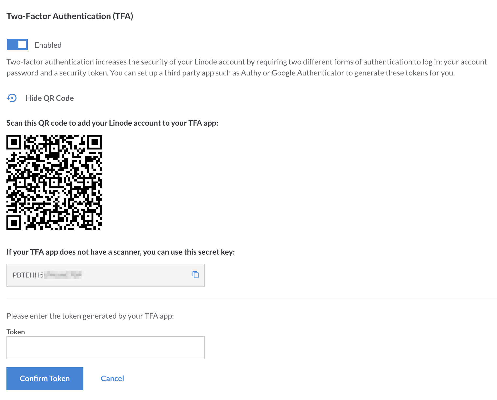
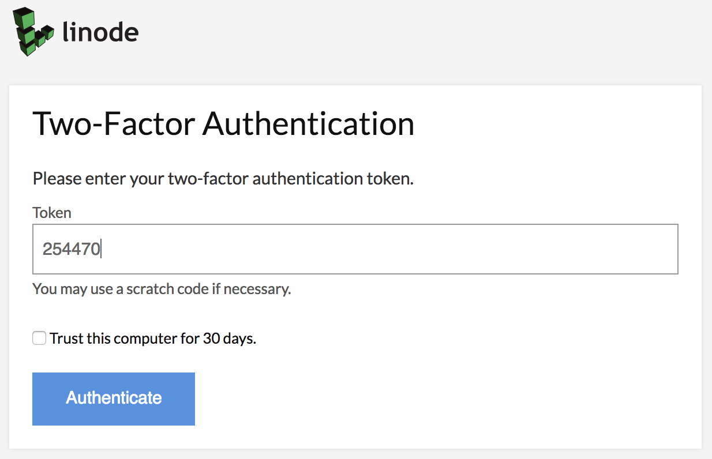
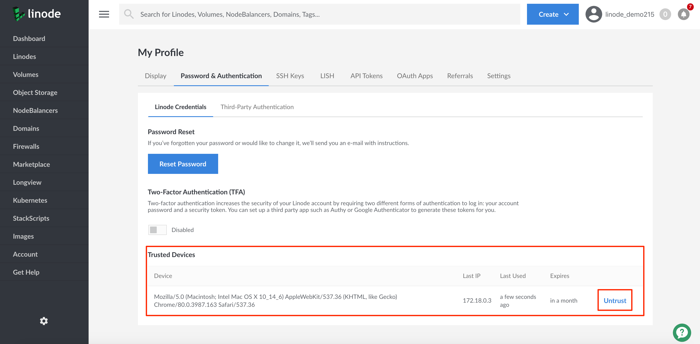

---
author:
  name: Linode
  email: docs@linode.com
description: 'How to use two-factor authentication and other security controls in the Linode Cloud Manager.'
og_description: 'This guide describes the security features of the Linode Cloud Manager, including two-factor authentication, IP address whitelisting, API access controls, forced password expiration, and more.'
keywords: ["two-factor authentication", "password", "security", "Linode Cloud Manager", "token"]
tags: ["security","cloud manager"]
license: '[CC BY-ND 4.0](https://creativecommons.org/licenses/by-nd/4.0)'
aliases: ['/linode-manager-security/','/security/authentication/linode-manager-security-controls/','/security/linode-manager-security-controls-new-manager/','/platform/manager/keep-your-linode-account-safe/','/security/linode-manager-security-controls/','/security/authentication/two-factor-authentication/linode-manager-security-controls/']
modified: 2019-01-08
modified_by:
  name: Linode
published: 2013-05-02
title: Linode Cloud Manager Security Controls
---

The [Linode Cloud Manager](https://cloud.linode.com) is the gateway to all of your Linode products and services, and you should take steps to protect it from unauthorized access.

This guide documents several of the Linode Cloud Manager's features that can help mitigate your risk. Whether you're worried about malicious users gaining access to your username and password, or authorized users abusing their access privileges, the Linode Cloud Manager's built-in security tools can help.

Start by [enabling two-factor authentication](#enable-two-factor-authentication) to protect your account with a physical token, and then [configure security event notifications](/docs/platform/manager/what-are-the-cloud-manager-events-and-activity-feeds/#manage-email-event-notifications) for your Linode account. You'll also learn how to [control API access](#api-access), [configure user accounts](#configure-user-accounts), and [force password expirations](#force-password-expirations).

## Two-Factor Authentication

Two-factor authentication increases the security of your Linode account by requiring two forms of authentication: something you have, and something you know. You're already familiar with this concept if you've ever used a debit card at an ATM. The debit card is something you have, and the PIN access code is something you know. You need both the debit card and the PIN to access your bank account.

If you enable this optional feature in the Linode Cloud Manager, you'll access your Linode account using your smartphone as a physical token in addition to your username and password. This additional layer of security reduces the risk that an unauthorized individual will gain access to your Linode account.

### Select a Token Application

Before you enable two-factor authentication in the Cloud Manager, select a token application for your smartphone. This guide will use Authy as an example, but you can use any application that supports the Time-based One-Time Password (TOTP) algorithm. For example, you can use any of the following applications:

* [Authy](https://authy.com/features/setup/) (iOS/Android/Chrome)
* [Google Authenticator](http://support.google.com/accounts/bin/answer.py?hl=en&answer=1066447) (iOS/Android/BlackBerry)
* [Duo Mobile](http://guide.duosecurity.com/third-party-accounts) (iOS/Android)

Install one of these applications on your smartphone before continuing.


Authy stores your authentication tokens (hashed for security) on their servers. This makes it possible for them to support backing up and restoring tokens, as well as making it easy to switch devices. However, some users may not be comfortable storing sensitive information in the cloud; for these users, Google Authenticator is a better choice, as the authentication keys are only stored locally.


### Enable Two-Factor Authentication

Enable two-factor authentication to start using it with your Linode account.

1.  Log in to the [Linode Cloud Manager](https://cloud.linode.com).
1.  Select the **My Profile** link by clicking on your username at the top of the page:

   

1.  Select the **Password & Authentication** tab.
1.  If not already selected, navigate to the **Linode Credentials** tab.
1.  In the **Two-Factor Authentication (TFA)** section, toggle the **Disabled** switch so that it reads **Enabled** to enable Two-Factor Authentication.
1.  A new form (depicted below) will appear. Write down the **Secret Key** and store it in a safe place:

    

1.  On your smartphone, open Authy.

1.  Tap **Add Account**.

1.  Tap **SCAN QR CODE**.

1.  Point your device's camera at the barcode on your computer screen. The app creates a new token for your Cloud Manager login, automatically. It will be labeled **LinodeManager:user**. Change the account name if necessary, and press **Done**.

1.  In the **Token** field of the Two-Factor Authentication form, enter the Linode Token, and click **Save**.

<!-- 12. Note the *Scratch Code* and store it in a secure place. You will use this code if the device with the two-factor code is not available. -->

That's it! You've successfully enabled two-factor authentication and set up token generation on your smartphone.

### Log in with Two-Factor Authentication

Now that you have set up two-factor authentication for your account, you'll need to have your token available whenever you log in to your account. Here's how to log in to the Linode Cloud Manager with two-factor authentication enabled:

1.  Open the [Linode Cloud Manager](https://cloud.linode.com) in your web browser.

1.  On your smartphone, open Authy, and then select your **LinodeManager:user** account.

1.  In your web browser, enter your username and password and click **Log in**. The webpage shown below appears.

    

1.  Enter your token, and then click **Authenticate**. Checking the box below the authentication option will add your computer to the trusted computer list for 30 days, and generate a confirmation email to the address on file for your account.

You have successfully logged in to the Linode Cloud Manager using two-factor authentication.

<!--
### Scratch Code

Generating a one-time use scratch code is also recommended. In the event that your smartphone is unavailable or the token is lost, you can use this code one time to log back in to the Linode Manager and regenerate the secret key. By default the scratch code is disabled.

1.  Click on the **generate** link to create a code.

    

2.  A pop-up window will appear asking you to confirm the action. Click **OK**.

    

3.  The scratch code is displayed. This code will be displayed only once, so write it down and store it somewhere safe.

    

-->

### Generate a New Key

The Linode Cloud Manager allows you to generate a new secret key for your two-factor authentication token device. This is a good way to start using a new smartphone as your two-factor token device. Here's how to generate a new secret key:

1.  Log in to the [Linode Cloud Manager](https://cloud.linode.com).
1.  Select the **My Profile** link by clicking on your username at the top of the page:

   

1.  Select the **Password & Authentication** tab.
1.  If not already selected, navigate to the **Linode Credentials** tab.
1.  In the **Two-Factor Authentication (TFA)** section, click **Reset two-factor authentication**, as shown below.

    

A new secret key and barcode will be generated for your account and displayed on the screen. Follow the instructions in the [Enabling Two-Factor Authentication](#enabling) section to add the new key to your smartphone.

### Disable Two-Factor Authentication

You can disable two-factor authentication for your Linode account at any time. Here's how:

1.  Log in to the [Linode Cloud Manager](https://cloud.linode.com).
1.  Select the **My Profile** link by clicking on your username at the top of the page:

   

1.  Select the **Password & Authentication** tab.
1.  If not already selected, navigate to the **Linode Credentials** tab.
1.  In the **Two-Factor Authentication (TFA)** section, toggle the **Enabled** switch to disable two-factor Authentication.
1.  A confirmation window appears asking if you want to disable two-factor authentication. Click **Disable Two-Factor Authentication**.

You have successfully disabled the two-factor authentication feature for your Linode Cloud Manager account.

### Recovery Procedure

If you lose your token and get locked out of the Manager, or need to have 2FA removed from a Linode account for another reason, please submit the following images:

- An image of the front and back of the payment card on file, which clearly shows the last 6 digits of the card number, the expiration date, cardholder name, and bank logos.
- An image of the front and back of Government-issued photo ID that matches the name on the card.

These images may be uploaded as attachments to this ticket via the Linode Manager. If you prefer encrypted communication, you can upload your images to our [Credential Submission Portal](https://www.linode.com/credential-submission/)
## Manage Trusted Devices

Whenever you log into the Cloud Manager from a new device or computer, you can choose to _Trust this computer for 30 days_. This means your device will not be prompted for a username or password for 30 days. The Cloud Manager displays a list of all trusted devices for your account and gives you the ability to *untrust* any device on the list. Your account's associated email address will also be notified whenever a new device is trusted. To view and manage your account's trusted devices:

1.  Log in to the [Linode Cloud Manager](https://cloud.linode.com).
1.  Select the **My Profile** link by clicking on your username at the top of the page:

      

1.  Select the **Password & Authentication** tab. Then, select the **Linode Credentials** tab, and navigate to the  **Trusted Devices** section.

      

    You can view all your account's trusted devices and *untrust* any device, as needed. Any device that is untrusted, will be prompted to re-enter their username and password when attempting to log into your Cloud Manager account.

<!--
## IP Address Whitelisting

The IP Address Whitelist feature protects your Linode Manager account from unauthorized access attempts by accepting connections only from the IP addresses you specify. It's easy to use. Just enable the feature, add your IP address, and log in. If you ever attempt to log in from an IP address that is not on the whitelist, you'll receive an email notification — you can click the link in the email message to add the new IP address to the whitelist.

### Enable Whitelisting

The first step is enabling the IP address whitelist feature in the Linode Manager. Here's how:

1.  Find your computer's or router's IP address.
2.  Log in to the [Linode Manager](https://cloud.linode.com).
2.  Select the **My Profile** link by clicking on your username at the top of the page:

   

3.  Select the **Password & Authentication** tab.
4.  In the *Account Security* section, select **Enabled** from the **Status** menu, as shown below.

    

5.  Click **Save security setting**. The IP address whitelist feature will be enabled.
6.  In the *Account Security* section, select the **Edit Whitelist** link to add your IP address, as shown below.

    

7.  Enter your IP address and netmask, and then click **Add IP**. You can add as many IP addresses as you want.

The IP address whitelist feature is now enabled for your Linode Manager account.

### Add Additional IP Addresses Remotely

Now that the IP address whitelist feature is enabled and you've added one or more IP addresses, your Linode Manager account is protected from unauthorized access attempts originating from any IP address not on the whitelist. However, it is easy to add additional IP addresses to the whitelist when you're away from home. Just attempt to log in to the Linode Manager from the new IP address and you'll receive an email notification — click the link in the email message to add the new IP address to the whitelist. You can also add additional IP addresses using the **my profile** page in the Linode Manager, as described in the previous section.

### Disable Whitelisting

You can disable the IP address whitelist feature at any time. Here's how:

1.  Log in to the [Linode Manager](https://cloud.linode.com).
2.  Select the **my profile** link.
3.  Enter your password, and then click **Authenticate**.
4.  Select the **Password & Authentication** tab.
5.  In the *Account Security* section, select **Disabled** from the **Status** menu, as shown below.

    

6.  Click **Save security setting**.

The IP address whitelist feature is disabled. From now on you will be able to log in to the Linode Manager from any IP address.

## Security Event Notifications

By default, the Linode Manager automatically notifies you via email when any Linode jobs are added to the *Host Job Queue*. Referred to as *event notifications*, this security control can help you monitor your Linode Manager account's activity. You can also subscribe to an RSS feed, or disable email event notifications entirely. This section shows you how to configure event notifications.
-->

<!--
### Email

You can enable and disable event notifications sent via email in the Linode Manager. This feature is enabled for all accounts by default, but you can disable it or reenable it at any time. Here's how:

1.  Log in to the [Linode Manager](https://cloud.linode.com).
2.  Select the **My Profile** link by clicking on your username at the top of the page:

   

3.  Select the **Settings** tab.
4.  In the *Notifications* section, toggle **Toggle Event Email Notifications**, as shown below.

    

If the events email notification was enabled before you clicked the button, it is now disabled, and vice versa.

### RSS

The event notifications for your Linode Manager account are also available as an RSS feed. The URL is displayed in the Linode Manager on your profile — you can add it to any RSS reader. You can also regenerate the URL. Here's how:

1.  Log in to the [Linode Manager](https://cloud.linode.com).
2.  Select the **my profile** link.
3.  Enter your password, and then click **Authenticate**.
4.  Select the **Notifications** tab.
5.  The RSS feed URL is displayed in the *Linode Events RSS* section, as shown below.

    

6.  To regenerate the URL for the RSS feed, click **Generate a new RSS key**.

If you regenerated the URL for the RSS feed, you will need to update it in your RSS reader.

-->

## API Access

The [Linode API](https://www.linode.com/api/) is a programmatic interface for many of the features available in the Cloud Manager. It's an indispensable tool for developers, but it's also a potential attack vector. For this reason, the Linode Cloud Manager provides two security controls for your account's API key. First, you can generate a new API key if you suspect that your existing key has been compromised. And if you're not using the API key, you can remove access to it altogether.

For details on generating and removing API keys, please see the [API Key](/docs/platform/api/api-key/) article.

## Next Steps
If you've completed this guide, you've proactively taken steps to protect your Linode account. There are a couple of other steps that some users should take to secure their Linode accounts. Take some time and work through the following action items outlined in our other guides.

### Configure User Accounts

Organizations that have multiple individuals accessing the same Cloud Manager account should create separate *user accounts* for each individual. Once you've created the accounts, you can assign permissions to restrict access to certain areas of the control panel. This is useful for groups that need to grant all team members access to the Cloud Manager, or organizations that just want their billing department to have a separate account to receive invoices and billing information. For more information, see our guide on [Accounts and Passwords](/docs/platform/accounts-and-passwords).
