Cherokee is a fast, flexible web server for POSIX compliant operating systems such as Linux. It's designed to be easy to administer, and includes support for a wide range of common web server functions. This tutorial explains how to configure Cherokee to serve dynamic content with PHP via FastCGI on Fedora 13.

This document assumes that your system is already running the Cherokee web server. If you haven't already installed Cherokee, please follow our [Fedora 13 Cherokee installation](/docs/web-servers/cherokee/installing-cherokee-fedora-13) guide before continuing with these instructions. Please make sure you are logged into your Linode as root via SSH.

## Install Required Packages

Make sure your repositories and packages are up to date by issuing the following command:

    yum update

Issue the following commands to install support for PHP and FastCGI:

    yum install php php-cli spawn-fcgi

Issue the following sequence of commands to create scripts to control `spawn-fcgi` and the PHP-FastCGI process, set the permissions for these scripts, ensure that PHP-FastCGI starts as part of the boot process, and start PHP-FastCGI For the first time:

    cd /opt/
    wget -O php-fastcgi-rpm.sh http://www.linode.com/docs/assets/597-php-fastcgi-rpm.sh
    wget -O php-fastcgi-init-rpm.sh http://www.linode.com/docs/assets/596-php-fastcgi-init-rpm.sh
    mv /opt/php-fastcgi-rpm.sh /usr/bin/php-fastcgi
    mv /opt/php-fastcgi-init-rpm.sh /etc/init.d/php-fastcgi
    chmod 755 /usr/bin/php-fastcgi
    chmod 755 /etc/init.d/php-fastcgi
    chkconfig --add php-fastcgi
    chkconfig php-fastcgi on
    groupadd www-data
    useradd -g www-data -d /dev/null -s /bin/false www-data
    service php-fastcgi start

Issue the following commands to change ownership of needed directories to the `www-data` user and start Cherokee.

    chown -R www-data:www-data /var/log/cherokee/
    chown -R www-data:www-data /var/lib/cherokee/
    service cherokee start

## Configure Your Site

Create directories for your site by issuing the following commands. Substitute your domain name for "example.com" in these commands.

    mkdir -p /srv/www/example.com/www/public_html
    mkdir /srv/www/example.com/www/logs
    chown -R www-data:www-data /srv/www/example.com

If you haven't already done so, start the Cherokee administration program by issuing the following command. Alternately, you may wish to follow our instructions for [secure Cherokee admin access](/docs/web-servers/cherokee/websites-with-the-cherokee-web-server-on-fedora-13/#secure-admin-panel-access).

    cherokee-admin -b &

Navigate to the "Remote Access" tab on the "General" page in the admin interface. You may wish to enable SSL support, change the server tokens, or enable graphs.

[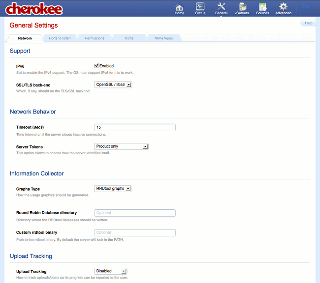](251-fedora-13-01-general-network-large.png)

On the "Permissions" tab, change the user and group.

[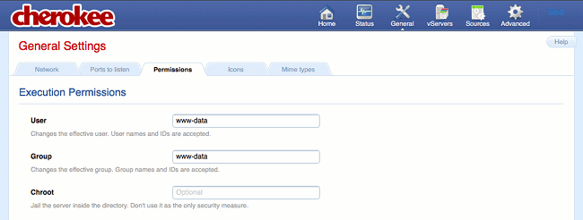](252-fedora-13-03-general-permissions-large.png)

Navigate to the "vServers" page and click the "New" button. Supply your domain name and the path to your site's document root.

[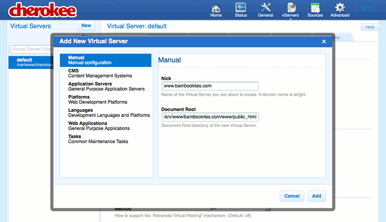](253-fedora-13-04-vservers-new-manual-large.png)

On the "Host Match" tab, specify the wildcard pattern to use for matching inbound requests.

[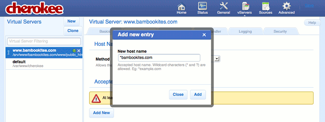](254-fedora-13-05-host-match-domain-large.png)

On the "Behavior" tab of your new vhost, delete all existing rules except for the "Default" rule.

[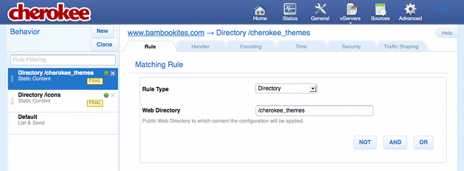](255-fedora-13-07-rule-delete1.png)

[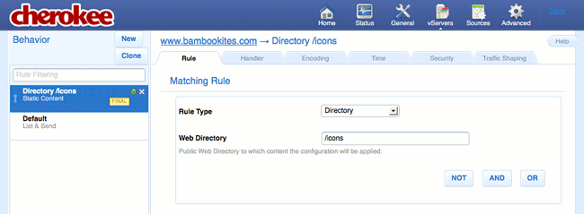](256-fedora-13-08-rule-delete2.png)

On the "Logging" tab for the vhost, specify appropriate log file settings.

[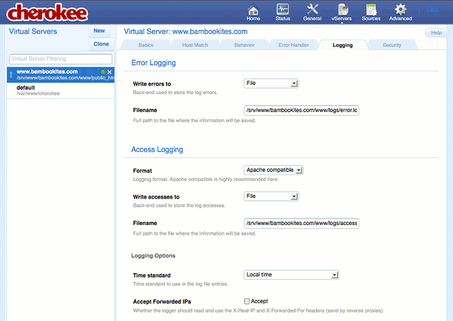](257-fedora-13-09-logging-large.png)

Navigate to the "Sources" page and click the "New" button. Enter the values shown below.

[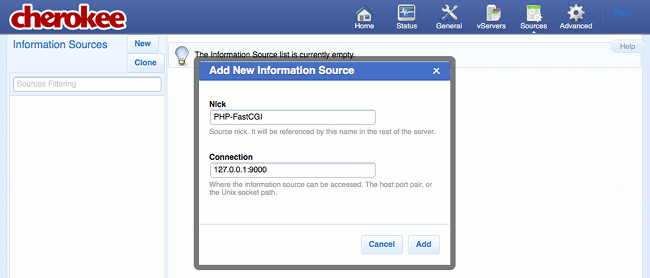](258-fedora-13-10-new-information-source-large.png)

Navigate to the "vServers" page and select your vhost. Click the "Default" link on the "Behavior" tab.

Click the "New" button on the "Handler" tab.

Click the "New" button and add a rule for PHP.

[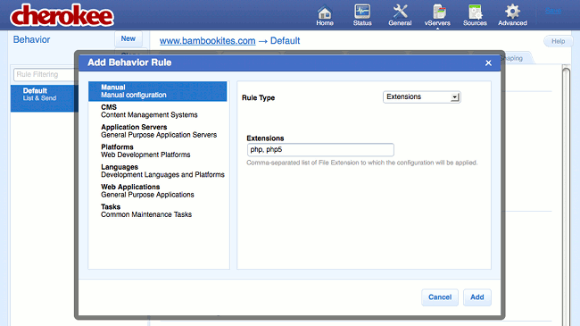](262-fedora-13-14-behavior-new-extensions-large.png)

Specify "FastCGI" for the handler and add your existing data source to the "Sources" section.

[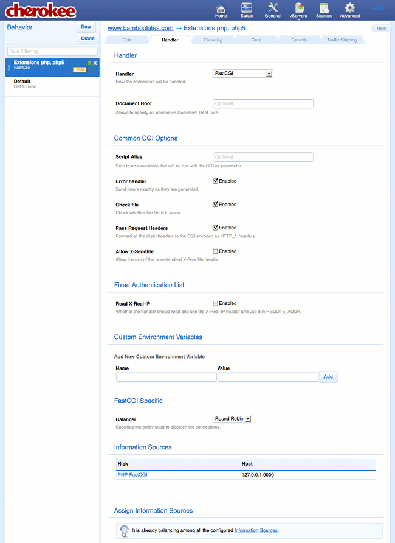](263-fedora-13-15-behavior-new-fastcgi-large.png)

On the "Encoding" tab, enable support for gzip and deflate compression.

Navigate to the "Status" page and select your vhost. Check the box labeled "Collect Statistics" near the bottom of the page. The image below shows how traffic graphs will look after the server has been accepting requests for some time; your graphs will be blank for now.

[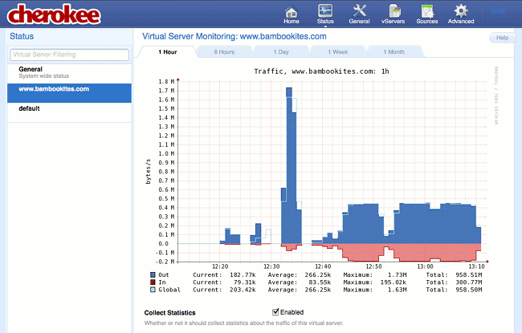](265-fedora-13-17-status-collect-statistics-large.png)

Save your changes and restart Cherokee.

Cherokee should now be properly configured. If you receive any errors when restarting the server, please go back and review each step you took for accuracy.

## Test Your Configuration

Create a test PHP script as follows:


<?php echo "<html><body><h1>This is a test. It is only a test.</h1></body></html>"; ?>



Visit `/test.php` on your site to verify PHP-FastCGI is operating correctly. Congratulations, you've successfully configured PHP-FastCGI for dynamic content using the Cherokee web server!

## More Information

You may wish to consult the following resources for additional information on this topic. While these are provided in the hope that they will be useful, please note that we cannot vouch for the accuracy or timeliness of externally hosted materials.

- [Cherokee Web Server Documentation](http://www.cherokee-project.com/doc/)
- [FastCGI Project Information](http://www.fastcgi.com/drupal/)
