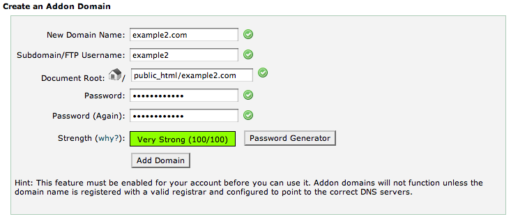
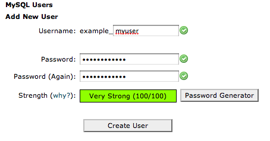
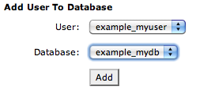
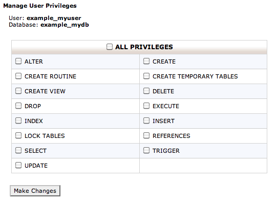
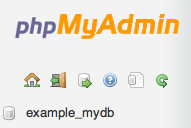

---
author:
  name: Chris C.
  email: docs@linode.com
description: Use cPanel to Manage Domains and Databases
keywords: ["cpanel", "database", "managing domain", "subdomain", "add-on domain", "parked domain", "phpmyadmin", "mysql", "create database", "manage database"]
tags: ["centos","dns","cms","cpanel"]
license: '[CC BY-ND 4.0](https://creativecommons.org/licenses/by-nd/4.0)'
aliases: ['/websites/cms/cpanel/use-cpanel-to-manage-domains-and-databases/','/websites/cms/managing-domains-and-databases/','/websites/cms/use-cpanel-to-manage-domains-and-databases/','/web-applications/control-panels/cpanel/managing-domains-and-databases/']
modified: 2017-02-15
modified_by:
  name: Linode
published: 2012-06-08
title: Use cPanel to Manage Domains and Databases
external_resources:
 - '[cPanel Home Page](http://cpanel.net)'
 - '[cPanel Support](http://cpanel.net/support.html)'
---

[cPanel](http://cpanel.net) is a commercial web-based control panel that simplifies many common system administration tasks such as website creation, database deployment and management, and more. This guide shows you how to manage your domains and databases with your cPanel user account. All of these instructions pertain to the user login located at port 2082 (2083 for SSL connection).

## Managing Domains

Three types of domains can be associated with your cPanel account: main domains, add-on domains, and parked domains. Your main domain cannot be changed except by the reseller that owns your account or by root itself. Subdomains, add-on domains, and parked domains can be managed in the Domains section.

 
The Domains section also allows you to add or delete A or CNAME records to or from your domain. Any of the default entries would need to be modified by someone with the appropriate access (e.g., the reseller that owns your account or the root user).


### Subdomains

You can manage subdomains in the cPanel \> Domains \> Subdomains section. To add a subdomain, enter the subdomain in the **Subdomain** field, and then click in the 'Document Root' field. A location will automatically be entered for you, as shown below.

After you add the subdomain, you can click the **Go Back** button to manage your subdomain's redirection or remove it entirely, as shown below.

### Add-on Domains

If you have the ability to use add-on domains, you can manage those through the cPanel \> Domains \> Addon Domains section. Add-on domains allow you to host other domains on your single cPanel account login and serve different content than what is served for your account's main domain. The interface is similar to the subdomains screen with a few extra fields, as shown below. A new FTP account is created for each add-on domain as well.

After you add the add-on domain, you can click the **Go Back** button to manage your add-on domain's redirection or remove it entirely, as shown below.

### Parked Domains

Parked domains allow you to point other domain names at your account. They then serve the contents of the domain you park them on top of:

After you add a parked domain, you can click the **Go Back** button to manage your parked domain's redirection or remove it entirely:

In the above example, the parked domain 'mynewdomain.com' is serving the content of your primary cPanel domain. You can modify this to serve whatever domain content you like. To instead serve the content of your add-on domain "example2.com," click the **Manage Redirection** button and enter example2.com into the field shown below.

## Create Databases and MySQL Users

The **Manage Databases** icon under the Databases section of your cPanel will allow you to create databases, create users for those databases, add users to databases, and specify the permissions each user should have. Let's start by creating a database.

Now that you've created a database, you'll need a user to access it. You can add a user below the add database section, as shown below.

After you've created the user, you can add the user to the database at the bottom of the MySQL Databases page, as shown below.

Once you select which users to add to the database, click the **Add** button. On the next screen you will be able to select what privileges the user will have to the database. You can select them individually or select the **All Privileges** checkbox at the top, as shown below.

## Manage Databases

Now that you've set up your database and user, you can start managing your database. cPanel includes phpMyAdmin for database management. Here's how to access phpMyAdmin:

1.  Click the **Home** button at the top of the page, then scroll back down to the Databases section of cPanel.
2.  Click the phpMyAdmin icon to open its interface in a new window.
3.  On the left side, you'll see a list of your databases. Select the database you want to open, as shown below.

You can now begin working on your database. If you have an .sql file you would like to use to set up the database and populate it, select the **Import** tab at the top of the screen. You will be able to browse to your .sql file and upload it to be imported into your database.
